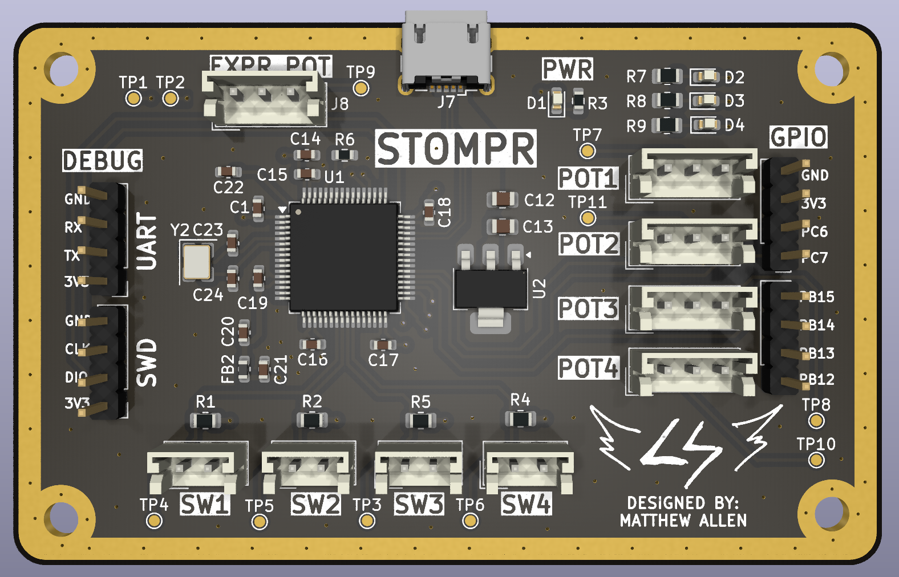

# STM32 MIDI Controller

This project acts a MIDI controller to send commands to a DAW such as Reaper. Not only is this a great learning platform, but it lets you control parameters for plugins and effects such as: turning a digital e
ffect on/off, controlling an expression pedal, etc.

